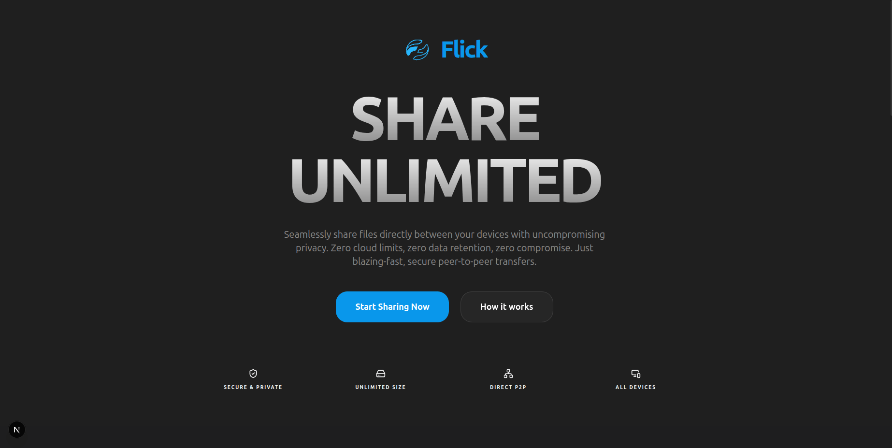
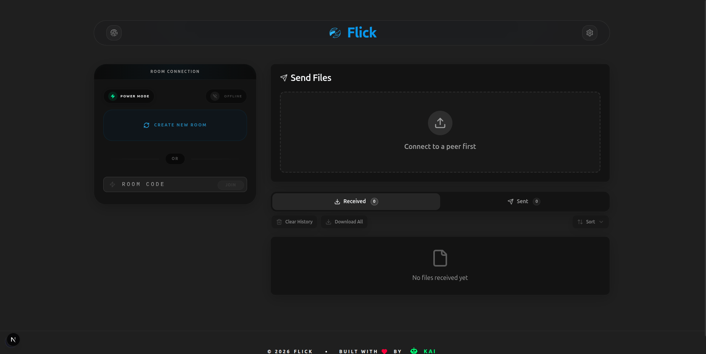

<div align="center">
  
  <h1>Flick</h1>
  <p>Instant Peer-to-Peer File Sharing</p>
</div>

Flick is a modern Progressive Web App (PWA) that enables **direct device-to-device file sharing** using WebRTC technology. Built with **Next.js**, **PeerJS**, and **Tailwind CSS**, it features a beautiful dark mode UI, unlimited file size support, and zero backend storage for ultimate privacy.

<div align="center">
  <br />
  
  <br />
</div>

## ✨ Core Features

- **🔗 Direct P2P Transfer**: Share files instantly between devices using WebRTC.
- **📦 Unlimited Sizes**: Handle limitless file sizes with optimized 64KB chunked transfer.
- **🔐 Absolute Privacy**: Zero server storage—your files flow end-to-end securely.
- **📱 Cross-Platform**: Fully responsive design, installable as a PWA on all devices.
- **🎨 Elite UI**: Stunning dark-mode interface built with Shadcn UI and Framer Motion.
- **📊 Live Progress**: Real-time progress tracking and speed monitoring.
- **🔄 Bidirectional**: Both connected devices can send and receive simultaneously.

---

## 📸 Interface In Action

### Simple Room-Based Connection

Connect your devices by simply sharing a 6-character room code. No accounts or registration required.



<br />

---

## 🛠️ Technology Stack

- **Framework**: [Next.js 15+](https://nextjs.org/)
- **Core Library**: [React 19](https://react.dev/)
- **Language**: [TypeScript 5](https://www.typescriptlang.org/)
- **Styling**: [Tailwind CSS 3.4+](https://tailwindcss.com/)
- **UI Components**: [Shadcn UI](https://ui.shadcn.com/)
- **Icons**: [Lucide React](https://lucide.dev/)
- **P2P Networking**: [PeerJS](https://peerjs.com/) (WebRTC)
- **Local Storage**: [idb-keyval](https://github.com/jakearchibald/idb-keyval)
- **State Management**: [Zustand](https://github.com/pmndrs/zustand)
- **ZIP Handling**: [JSZip](https://stuk.github.io/jszip/)

---

## 🚀 Installation & Setup

Flick is a fully client-side application. No database setup required!

### 1. Prerequisites

Ensure you have the following installed:

- **Node.js 18+**
- **Docker** and **Docker Compose**
- **Git**

### 2. Setup & Execution

Clone the repository:

```bash
git clone https://github.com/your-repo/flick-p2p-file-sharing.git
cd flick-p2p-file-sharing
```

#### Option A: Local Development

Best for coding and active development with hot-reloading.

```bash
make install
make dev
```

#### Option B: Docker Environment

Runs the entire application in a containerized environment.

```bash
make build
make up
```

> **Access the app at:** [http://localhost:3000](http://localhost:3000)

---

<div align="center">
  
  <p>Built with ❤️ by <b>KAI</b></p>
</div>
